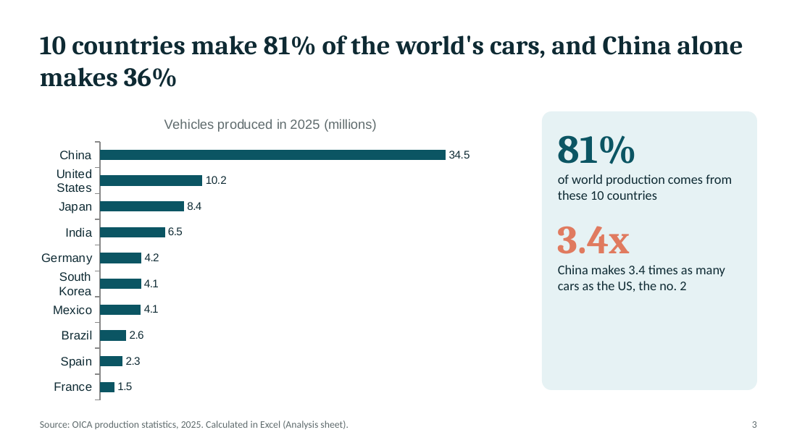
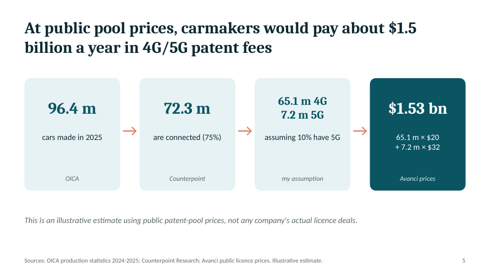
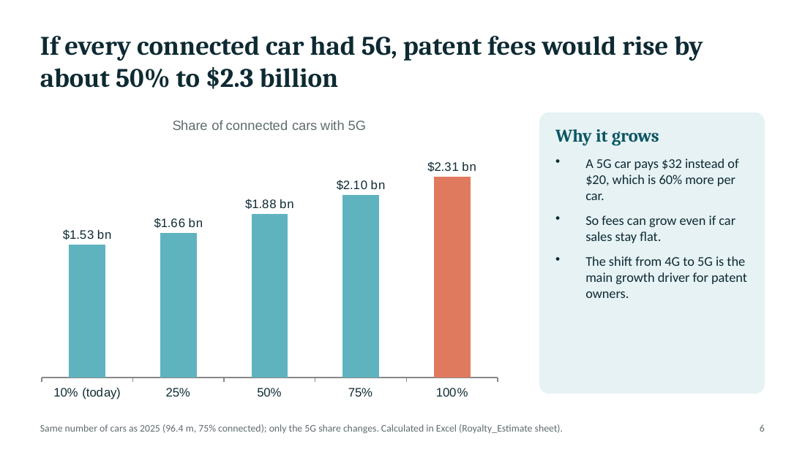

# Cars, 5G and Patent Fees: Market Snapshot & Royalty Estimate

A small Excel + PowerPoint project. It looks at **which countries make the world's cars** and estimates **how much carmakers could pay for 4G/5G mobile patents** at public patent-pool prices.

## Key findings

1. **10 countries make 81% of the world's cars, and China alone makes 36%.** China grew 10% in 2025, while 4 of the top 10 (US, South Korea, Mexico, Spain) made fewer cars.
2. **Carmakers would pay about $1.5 billion a year in 4G/5G patent fees** at public patent-pool prices (illustrative estimate).
3. **If every connected car had 5G, the fees would rise about 50%, to $2.3 billion**, because a 5G car pays $32 instead of $20.

## Files

| File | What it is |
|---|---|
| `car_production_5g_analysis.xlsx` | Excel workbook: Data, Analysis, Royalty_Estimate, Charts |
| `car_production_5g_presentation.pptx` | 7-slide PowerPoint presentation |
| `car_production_5g_presentation.pdf` | The same presentation as a PDF (viewable on GitHub) |

## What I did in Excel

- **Data:** typed in vehicle production for the top 10 countries and the world total, 2024 and 2025 (OICA).
- **Analysis:** change and growth % for each country, share of world production, `RANK`, totals with `SUM`, and quick facts with `AVERAGE`, `MAX`, `MIN`, `COUNTIF` and `INDEX/MATCH`. Conditional formatting shows growth in green and decline in red.
- **Royalty estimate:** cars × connected share × 4G/5G split × patent fee per car, plus a small what-if table for different 5G shares.
- **Charts:** bar and column charts, reused in the presentation.

## Note

This is an illustrative estimate based on public patent-pool prices (Avanci). It does not use any company's confidential licence terms.

## Sources

- OICA vehicle production statistics 2024–2025 ([OICA](https://www.oica.net), compiled in [Wikipedia](https://en.wikipedia.org/wiki/List_of_countries_by_motor_vehicle_production))
- Counterpoint Research: [75% of cars sold in 2024 had built-in cellular connectivity](https://www.counterpointresearch.com/insight/global-connected-cars-market-2024)
- Avanci: [4G and 5G vehicle licence prices](https://www.avanci.com/vehicle/)
